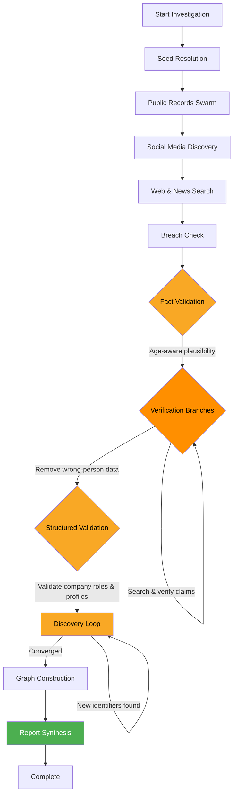
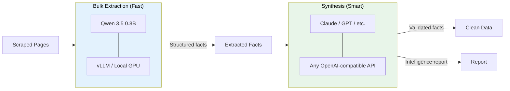
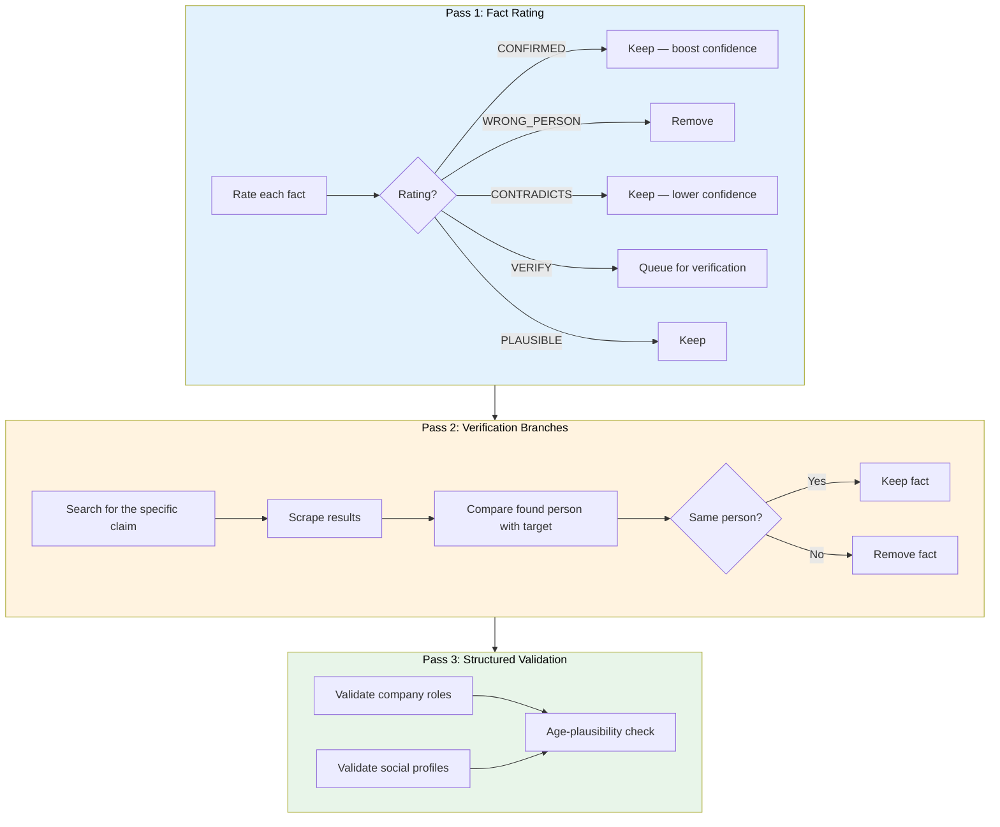
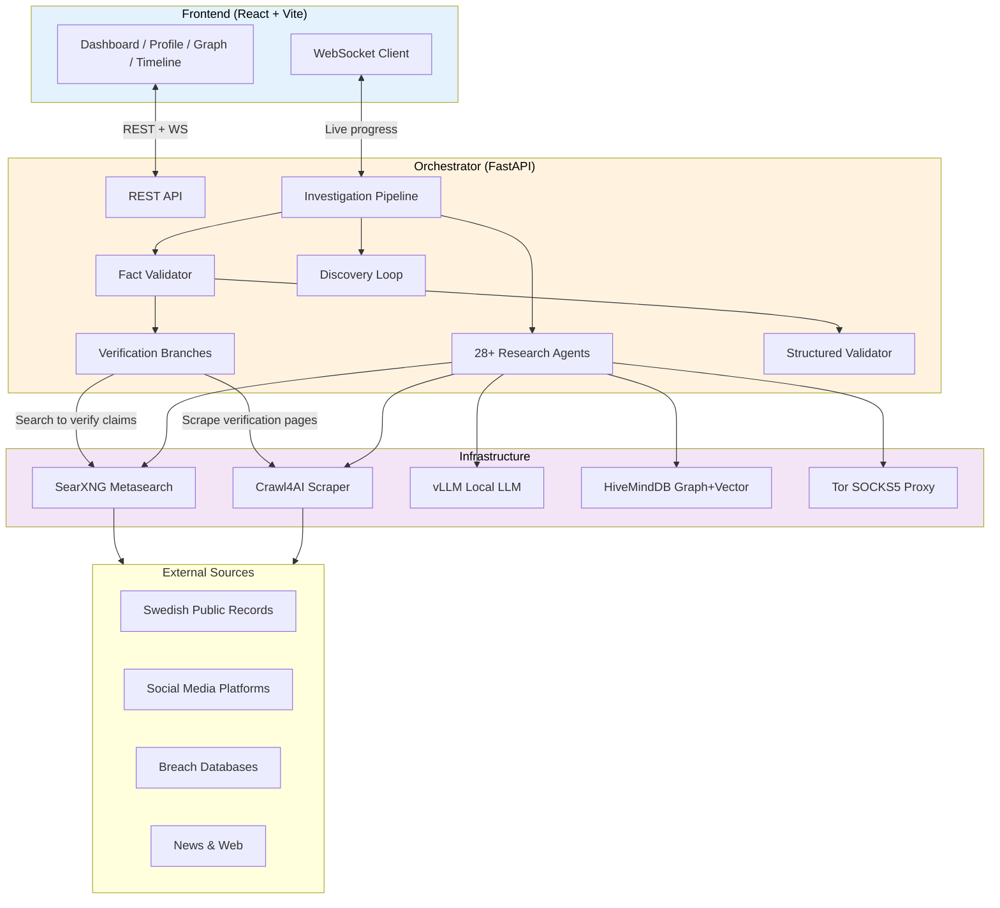

# Spindeln

**Swedish Person Intelligence Platform** — an AI-powered multi-agent OSINT system that searches, scrapes, extracts, validates, and synthesizes person data from Swedish public records, social media, breach databases, and the open web.

Built with a two-model architecture: a fast local model for bulk extraction and a synthesis model for identity verification, fact validation, and report generation.


---

## How It Works

### Investigation Pipeline



Each investigation runs through **11 phases**, orchestrated by a central pipeline that coordinates 28+ specialized agents:

| Phase | Description |
|-------|-------------|
| **Seed Resolution** | Anchor identity via Ratsit/Hitta (name, personnummer, DOB) |
| **Public Records** | Parallel swarm across 9 Swedish registries |
| **Social Media** | Multi-identifier search across 9 platforms (name + emails + handles) |
| **Web & News** | General web mentions + Swedish news sources |
| **Breach Check** | HIBP, IntelX, Hudson Rock, Ahmia, paste sites |
| **Fact Validation** | Three-pass validation: rate facts, verify uncertain claims via search, validate structured fields |
| **Discovery Loop** | Iterative re-search using found emails/handles/companies until convergence |
| **Graph Construction** | Knowledge graph + timeline in HiveMindDB |
| **Report Synthesis** | LLM-generated intelligence report with citations and risk assessment |
| **Embeddings** | Multi-category vector embeddings |
| **Loom Bridge** | Temporal data context (optional) |

### Two-Model Architecture



- **Bulk model**: Runs locally on GPU. Handles high-volume extraction from scraped pages. Cheap and fast.
- **Synthesis model**: Used for fact validation (identity disambiguation), verification branches, structured field validation, contradiction detection, and report generation. Can be any OpenAI-compatible API.

### Identity Disambiguation

The core challenge is **identity confusion** — searching "Oscar Nyblom" returns results from multiple people with the same name. Spindeln solves this with a multi-layered verification system:



1. **Identity anchors** — DOB, address, personnummer are threaded into every extraction prompt
2. **Age-aware validation** — current age is computed from DOB and used to reject implausible claims (e.g., a 20-year-old as chairman of a major company)
3. **Cross-referencing** — confirmed facts from earlier validation batches are fed into later batches for cross-reference
4. **Verification branches** — when the model is uncertain about a claim, it searches for it specifically (e.g., "Eniro chairman ordförande"), scrapes the results, and compares the found person against the target's identity
5. **Structured field validation** — company roles and social profiles are validated against the person's age and identity
6. **Contradiction detection** — conflicting birth dates and ages are automatically flagged and weaker sources are downranked
7. **Discovery loop** — found emails/handles trigger re-searches on other platforms, building a verified identity profile

### System Architecture



---

## Features

- **Real-time progress** — WebSocket live feed shows each agent's status during investigation
- **Three-pass fact validation** — rate, verify via search, validate structured fields
- **Verification branches** — uncertain claims trigger targeted searches to confirm or reject
- **Age-aware plausibility** — rejects claims inconsistent with the target's known age
- **Force-directed graph** — Interactive knowledge graph with people, companies, addresses, social profiles
- **Timeline view** — Chronological events with date extraction from free-text facts
- **8-tab profile view** — Overview, News, Financial, Companies, Social, Breaches, Connections, Report
- **Multi-identifier social search** — agents search by name + found emails + found handles
- **Discovery loop** — iterative re-search using discovered identifiers until convergence
- **Settings UI** — Configure models, API endpoints, and rate limits from the browser
- **MCP server** — Model Context Protocol interface for integration with other AI tools

---

## Quick Start

### Prerequisites

- Docker and Docker Compose
- NVIDIA GPU with 2+ GB VRAM (for local vLLM) — or use an external LLM API
- Git

### 1. Clone and Configure

```bash
git clone https://github.com/nodenestor/spindeln.git
cd spindeln
cp .env.example .env
# Edit .env with your API keys (all optional)
```

### 2. Start Services

**With local GPU (runs Qwen 3.5 on your GPU):**

```bash
docker compose --profile gpu up -d
```

**Without GPU (use an external LLM API instead):**

```bash
docker compose up -d
```

Then configure the bulk model URL in Settings (http://localhost:3001/settings) to point to any OpenAI-compatible API.

### 3. Access

| Service | URL |
|---------|-----|
| Frontend | http://localhost:3001 |
| API | http://localhost:8083/api/health |
| SearXNG | http://localhost:8889 |

### 4. Run Your First Investigation

1. Open http://localhost:3001
2. Click "New Investigation"
3. Enter a name and optional city
4. Watch the real-time agent swarm progress
5. Explore the profile, graph, timeline, and report tabs

---

## Configuration

All settings can be changed at runtime from the **Settings** page or via the API.

### Models

| Setting | Description | Default |
|---------|-------------|---------|
| `bulk_api_url` | Extraction model endpoint | `http://vllm:8000/v1` |
| `bulk_model` | Model name for extraction | `Qwen/Qwen3.5-0.8B` |
| `synthesis_api_url` | Synthesis model endpoint | Same as bulk |
| `synthesis_model` | Model name for validation/reports | Same as bulk |

The synthesis model is used for:
- Fact validation (three-pass: rate, verify, structured)
- Verification branches (searching and comparing claims)
- Structured field validation (company roles, social profiles)
- Report generation with citations and risk assessment
- Any agent with `use_synthesis_model = True`

### Optional API Keys

| Key | Service | What It Enables |
|-----|---------|-----------------|
| `HIBP_API_KEY` | Have I Been Pwned | Email breach history lookup |
| `INTELX_API_KEY` | Intelligence X | Dark web and paste site search |
| `HUDSONROCK_API_KEY` | Hudson Rock | Infostealer malware exposure check |

### Discovery Loop

| Setting | Description | Default |
|---------|-------------|---------|
| `max_discovery_iterations` | Max re-search cycles using found identifiers | `5` |
| `scrape_concurrency` | Parallel scrape limit | `5` |
| `scrape_delay_seconds` | Delay between scrapes | `2.0` |

---

## Project Structure

```
spindeln/
├── docker-compose.yml          # Full stack definition
├── .env.example                # Configuration template
├── orchestrator/               # Python backend
│   ├── Dockerfile
│   ├── requirements.txt
│   └── src/
│       ├── main.py             # FastAPI app, WebSocket, API endpoints
│       ├── investigate.py      # Investigation pipeline orchestrator
│       ├── models.py           # Pydantic data models
│       ├── config.py           # Settings + runtime config
│       ├── fact_validator.py   # Three-pass validation + verification branches
│       ├── embeddings.py       # Multi-category vector embeddings
│       ├── entity_resolution.py
│       ├── scraper/
│       │   ├── searxng_client.py   # SearXNG metasearch
│       │   ├── crawl4ai_client.py  # Web scraping
│       │   └── extractors.py      # LLM extraction prompts + JSON repair
│       ├── storage/
│       │   ├── client.py          # HiveMindDB async client
│       │   └── schemas.py         # Knowledge graph schema
│       ├── agents/
│       │   ├── base.py            # BaseAgent with identity anchors
│       │   ├── registry.py        # Agent discovery
│       │   ├── public_records/    # 9 Swedish registry agents
│       │   ├── social_media/      # 9 platform agents (multi-identifier search)
│       │   ├── breach/            # 6 exposure agents
│       │   ├── web/               # 3 web/news agents
│       │   └── analysis/          # Graph, timeline, synthesis agents
│       ├── loom/                  # Temporal data bridge
│       └── mcp/                   # MCP protocol server
├── frontend/                   # React frontend
│   ├── Dockerfile
│   ├── package.json
│   └── src/
│       ├── pages/              # Dashboard, Investigate, Profile, etc.
│       ├── components/         # Graph, Timeline, FactCard, etc.
│       └── stores/             # Zustand state management
└── docs/
    └── SOURCES.md              # Data sources + legal framework
```

---

## Research Agents

### Public Records (Swedish)

| Agent | Source | Data |
|-------|--------|------|
| ratsit | Ratsit.se | Income, tax, family, address, company roles |
| hitta | Hitta.se | Phone, address, neighbors |
| eniro | Eniro.se | Phone, address, business |
| merinfo | Merinfo.se | Age, property, nearby residents |
| bolagsverket | Bolagsverket API | Company registrations, board positions |
| riksdag | Riksdagen API | Political roles, parliamentary data |
| polisen | Polisen API | Local police events |
| scb | SCB API | Area demographics |

### Social Media

| Agent | Platform | Features |
|-------|----------|----------|
| facebook | Facebook | Multi-identifier search (name + emails + handles), bio parsing |
| instagram | Instagram | Handle/email discovery from bio, multi-identifier search |
| linkedin | LinkedIn | Professional data, employer extraction |
| twitter | Twitter/X | Bio parsing, handle discovery |
| youtube | YouTube | Channel discovery |
| tiktok | TikTok | Profile discovery |
| github | GitHub | SearXNG + GitHub API search |
| reddit | Reddit | Profile + post/comment mentions |
| flashback | Flashback.org | Swedish forum thread search |

### Breach / Exposure

| Agent | Source | Data |
|-------|--------|------|
| hibp | Have I Been Pwned | Email breach history |
| intelx | Intelligence X | Dark web, leaks |
| hudsonrock | Hudson Rock | Infostealer exposure |
| ahmia | Ahmia.fi | Tor .onion mentions |
| pastebin | Paste sites | Leaked data |
| google_dorks | Google Dorks | Exposed files/data |

---

## Fact Validation System

The fact validator is the core data quality layer. It runs after all agents complete and before the report is generated.

### Pass 1: Fact Rating
Each extracted fact is sent to the synthesis model with the target person's confirmed identity (name, DOB, current age, address, personnummer). The model rates each fact:
- **CONFIRMED** — clearly matches the target, confidence boosted
- **PLAUSIBLE** — could be this person, kept as-is
- **WRONG_PERSON** — about someone else with a similar name, removed
- **CONTRADICTS** — conflicts with confirmed facts, confidence lowered
- **VERIFY** — uncertain claim that needs verification research

### Pass 2: Verification Branches
Facts rated VERIFY trigger targeted searches:
1. The model provides a search query (e.g., "Eniro ordförande chairman")
2. SearXNG searches for the claim
3. Crawl4AI scrapes the top results
4. The synthesis model compares the found person with the target's identity
5. If different person → fact removed. If same person → fact confirmed.

### Pass 3: Structured Field Validation
Company roles (`foretag`) and social profiles are validated against the person's age and identity. A 20-year-old marked as chairman of a major public company gets that role removed.

### Contradiction Detection
Regex-based fast checks for conflicting birth dates and ages. If the person's known age is 20 but a fact claims 55, the fact is auto-flagged and confidence dropped to 0.2.

---

## API

### Endpoints

| Method | Path | Description |
|--------|------|-------------|
| `POST` | `/api/investigate` | Start investigation `{"query": "Name", "location": "City"}` |
| `GET` | `/api/investigate/:id` | Get investigation status + results |
| `GET` | `/api/sessions` | List all sessions |
| `GET` | `/api/persons/:id` | Get transformed person profile |
| `GET` | `/api/persons/:id/graph` | Get force-directed graph data |
| `GET` | `/api/persons/:id/timeline` | Get chronological events |
| `GET` | `/api/investigate/:id/report` | Get synthesis report |
| `GET/PUT` | `/api/config` | Get/update runtime configuration |
| `WS` | `/ws` | WebSocket for live progress events |

---

## Legal

This tool is designed for use within Swedish legal frameworks. Sweden's **offentlighetsprincipen** (principle of public access) makes personal data like income, tax, address, and company roles publicly accessible. See [docs/SOURCES.md](docs/SOURCES.md) for detailed legal basis and data source documentation.

**Use responsibly.** This tool aggregates publicly available information. Users are responsible for ensuring their use complies with applicable laws and regulations.

---

## License

MIT
