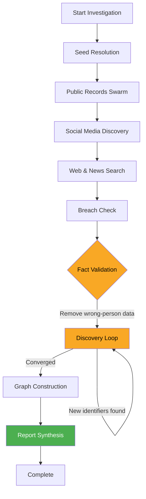
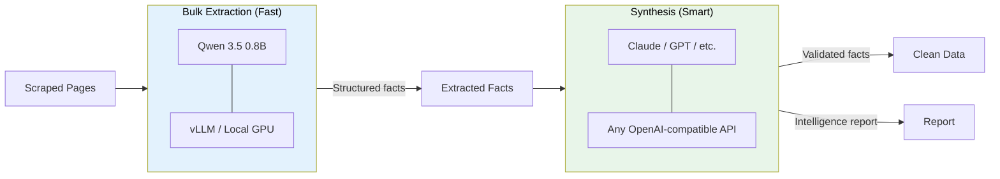
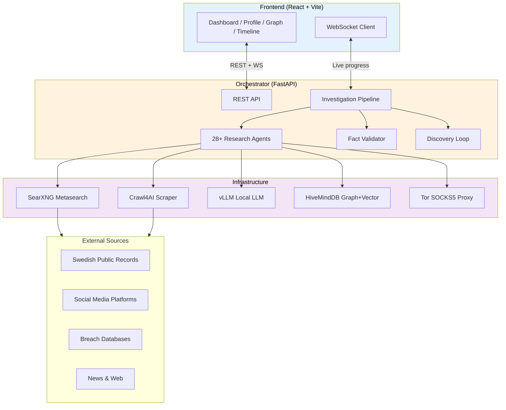

# Spindeln

**Swedish Person Intelligence Platform** — an AI-powered multi-agent OSINT system that searches, scrapes, extracts, validates, and synthesizes person data from Swedish public records, social media, breach databases, and the open web.

Built with a two-model architecture: a fast local model for bulk extraction and an optional synthesis model for identity verification, fact validation, and report generation.


---

## How It Works

### Investigation Pipeline



Each investigation runs through **11 phases**, orchestrated by a central pipeline that coordinates 28+ specialized agents:

| Phase | Description |
|-------|-------------|
| **Seed Resolution** | Anchor identity via Ratsit/Hitta (name, personnummer, DOB) |
| **Public Records** | Parallel swarm across 9 Swedish registries |
| **Social Media** | Multi-identifier search across 9 platforms |
| **Web & News** | General web mentions + Swedish news sources |
| **Breach Check** | HIBP, IntelX, Hudson Rock, Ahmia, paste sites |
| **Fact Validation** | Synthesis model verifies facts belong to the right person |
| **Discovery Loop** | Iterative re-search using found emails/handles/companies |
| **Graph Construction** | Knowledge graph + timeline in HiveMindDB |
| **Report Synthesis** | LLM-generated intelligence report with citations |
| **Embeddings** | Multi-category vector embeddings |
| **Loom Bridge** | Temporal data context (optional) |

### Two-Model Architecture



- **Bulk model**: Runs locally on GPU. Handles high-volume extraction from scraped pages. Cheap and fast.
- **Synthesis model**: Optional. Used for fact validation (identity disambiguation), contradiction detection, and report generation. Can be any OpenAI-compatible API.

### Identity Disambiguation

The core innovation is **iterative identity verification**. When searching "Oscar Nyblom", results may come from multiple people with the same name. Spindeln solves this with:

1. **Identity anchors** — DOB, address, personnummer are threaded into every extraction prompt
2. **Fact validation** — synthesis model rates each fact as CONFIRMED / PLAUSIBLE / WRONG_PERSON / CONTRADICTS
3. **Contradiction detection** — conflicting birth dates and ages are automatically flagged
4. **Discovery loop** — found emails/handles trigger re-searches on other platforms, building a verified identity profile

### System Architecture



---

## Features

- **Real-time progress** — WebSocket live feed shows each agent's status during investigation
- **Force-directed graph** — Interactive knowledge graph with people, companies, addresses, social profiles
- **Timeline view** — Chronological events with date extraction from free-text facts
- **8-tab profile view** — Overview, News, Financial, Companies, Social, Breaches, Connections, Report
- **Settings UI** — Configure models, API endpoints, and rate limits from the browser
- **MCP server** — Model Context Protocol interface for integration with other AI tools
- **Configurable discovery loop** — Set max iterations for iterative identity enrichment

---

## Quick Start

### Prerequisites

- Docker and Docker Compose
- NVIDIA GPU with 2+ GB VRAM (for local vLLM) — or use an external LLM API
- Git

### 1. Clone and Configure

```bash
git clone https://github.com/nodenestor/spindeln.git
cd spindeln
cp .env.example .env
# Edit .env with your API keys (all optional)
```

### 2. Start Services

**With local GPU (runs Qwen 3.5 on your GPU):**

```bash
docker compose --profile gpu up -d
```

**Without GPU (use an external LLM API instead):**

```bash
docker compose up -d
```

Then configure the bulk model URL in Settings (http://localhost:3001/settings) to point to any OpenAI-compatible API.

### 3. Access

| Service | URL |
|---------|-----|
| Frontend | http://localhost:3001 |
| API | http://localhost:8083/api/health |
| SearXNG | http://localhost:8889 |

### 4. Run Your First Investigation

1. Open http://localhost:3001
2. Click "New Investigation"
3. Enter a name and optional city
4. Watch the real-time agent swarm progress
5. Explore the profile, graph, timeline, and report tabs

---

## Configuration

All settings can be changed at runtime from the **Settings** page or via the API.

### Models

| Setting | Description | Default |
|---------|-------------|---------|
| `bulk_api_url` | Extraction model endpoint | `http://vllm:8000/v1` |
| `bulk_model` | Model name for extraction | `Qwen/Qwen3.5-0.8B` |
| `synthesis_api_url` | Synthesis model endpoint | Same as bulk |
| `synthesis_model` | Model name for validation/reports | Same as bulk |

The synthesis model is used for:
- Fact validation (identity disambiguation)
- Report generation
- Any agent with `use_synthesis_model = True`

### Optional API Keys

| Key | Service | What It Enables |
|-----|---------|-----------------|
| `HIBP_API_KEY` | Have I Been Pwned | Email breach history lookup |
| `INTELX_API_KEY` | Intelligence X | Dark web and paste site search |
| `HUDSONROCK_API_KEY` | Hudson Rock | Infostealer malware exposure check |

### Discovery Loop

| Setting | Description | Default |
|---------|-------------|---------|
| `max_discovery_iterations` | Max re-search cycles using found identifiers | `5` |
| `scrape_concurrency` | Parallel scrape limit | `5` |
| `scrape_delay_seconds` | Delay between scrapes | `2.0` |

---

## Project Structure

```
spindeln/
├── docker-compose.yml          # Full stack definition
├── .env.example                # Configuration template
├── orchestrator/               # Python backend
│   ├── Dockerfile
│   ├── requirements.txt
│   └── src/
│       ├── main.py             # FastAPI app, WebSocket, API endpoints
│       ├── investigate.py      # Investigation pipeline orchestrator
│       ├── models.py           # Pydantic data models
│       ├── config.py           # Settings + runtime config
│       ├── fact_validator.py   # Identity verification + contradiction detection
│       ├── embeddings.py       # Multi-category vector embeddings
│       ├── entity_resolution.py
│       ├── scraper/
│       │   ├── searxng_client.py   # SearXNG metasearch
│       │   ├── crawl4ai_client.py  # Web scraping
│       │   └── extractors.py      # LLM extraction prompts + JSON repair
│       ├── storage/
│       │   ├── client.py          # HiveMindDB async client
│       │   └── schemas.py         # Knowledge graph schema
│       ├── agents/
│       │   ├── base.py            # BaseAgent with identity anchors
│       │   ├── registry.py        # Agent discovery
│       │   ├── public_records/    # 9 Swedish registry agents
│       │   ├── social_media/      # 9 platform agents
│       │   ├── breach/            # 6 exposure agents
│       │   ├── web/               # 3 web/news agents
│       │   └── analysis/          # Graph, timeline, synthesis agents
│       ├── loom/                  # Temporal data bridge
│       └── mcp/                   # MCP protocol server
├── frontend/                   # React frontend
│   ├── Dockerfile
│   ├── package.json
│   └── src/
│       ├── pages/              # Dashboard, Investigate, Profile, etc.
│       ├── components/         # Graph, Timeline, FactCard, etc.
│       └── stores/             # Zustand state management
└── docs/
    └── SOURCES.md              # Data sources + legal framework
```

---

## Research Agents

### Public Records (Swedish)

| Agent | Source | Data |
|-------|--------|------|
| ratsit | Ratsit.se | Income, tax, family, address, company roles |
| hitta | Hitta.se | Phone, address, neighbors |
| eniro | Eniro.se | Phone, address, business |
| merinfo | Merinfo.se | Age, property, nearby residents |
| bolagsverket | Bolagsverket API | Company registrations, board positions |
| riksdag | Riksdagen API | Political roles, parliamentary data |
| polisen | Polisen API | Local police events |
| scb | SCB API | Area demographics |

### Social Media

| Agent | Platform | Features |
|-------|----------|----------|
| facebook | Facebook | Multi-identifier search, bio parsing |
| instagram | Instagram | Handle/email discovery from bio |
| linkedin | LinkedIn | Professional data, employer extraction |
| twitter | Twitter/X | Bio parsing, handle discovery |
| youtube | YouTube | Channel discovery |
| tiktok | TikTok | Profile discovery |
| github | GitHub | SearXNG + GitHub API search |
| reddit | Reddit | Profile + post/comment mentions |
| flashback | Flashback.org | Swedish forum thread search |

### Breach / Exposure

| Agent | Source | Data |
|-------|--------|------|
| hibp | Have I Been Pwned | Email breach history |
| intelx | Intelligence X | Dark web, leaks |
| hudsonrock | Hudson Rock | Infostealer exposure |
| ahmia | Ahmia.fi | Tor .onion mentions |
| pastebin | Paste sites | Leaked data |
| google_dorks | Google Dorks | Exposed files/data |

---

## API

### Endpoints

| Method | Path | Description |
|--------|------|-------------|
| `POST` | `/api/investigate` | Start investigation `{"query": "Name", "location": "City"}` |
| `GET` | `/api/investigate/:id` | Get investigation status + results |
| `GET` | `/api/sessions` | List all sessions |
| `GET` | `/api/persons/:id` | Get transformed person profile |
| `GET` | `/api/persons/:id/graph` | Get force-directed graph data |
| `GET` | `/api/persons/:id/timeline` | Get chronological events |
| `GET` | `/api/investigate/:id/report` | Get synthesis report |
| `GET/PUT` | `/api/config` | Get/update runtime configuration |
| `WS` | `/ws` | WebSocket for live progress events |

---

## Legal

This tool is designed for use within Swedish legal frameworks. Sweden's **offentlighetsprincipen** (principle of public access) makes personal data like income, tax, address, and company roles publicly accessible. See [docs/SOURCES.md](docs/SOURCES.md) for detailed legal basis and data source documentation.

**Use responsibly.** This tool aggregates publicly available information. Users are responsible for ensuring their use complies with applicable laws and regulations.

---

## License

MIT
